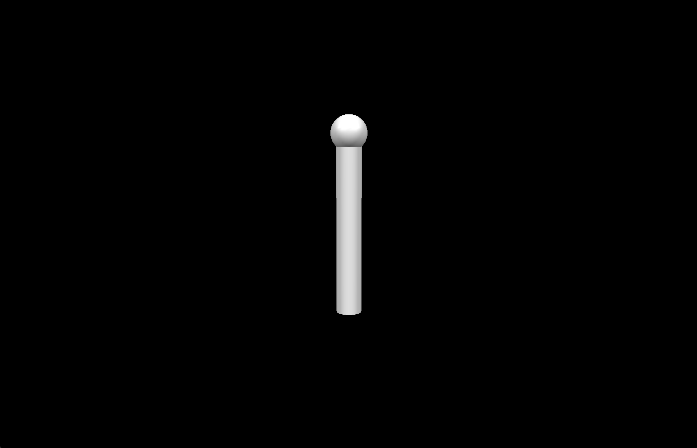

# Tutorial 1 - Simulation with pendulums

This tutorial aims at showcasing the main features of SAI when defining a simulation world. All the tutorial files are present in the `tutorials` folder.

A very basic and uncomplete simulation is provided. Following this tutorial, you will learn how to complete the roboti model, add things to the simulation and interact with it.

## Launching the simulation and understanding the config files

First, launch the first tutorial. From the root folder of the SAI repository:
```
sh scripts/tutorial_launch.sh 1
```

You should see a window opening, showing a sphere and cylinder on a black background:


This represents a simple pendulum, hanging vertically, attached to the world on its upper sphere. there are already a few things that you can do with this simulation:
- move, zoom and unzoom the camera using the mouse (scrolling wheel, left click + drag, center click + drag, crtl + left click + drag, shift + left click + drag, arrow keys, A or Z keys)
- interact with the pendulum by right clicking on the cylinder sphere and dragging it left or right

Note that the gravity seems not to afect the pendulum. We will change this soon.

In order to define a simulation in SAI, we need 3 types of files. We need a xml config file for the SAI simulation definition, we need a world file to define the virtual world, and we need a urdf file for each robot we want to simulate (in the current case, for the pendulum). Let's look at those files.

- The urdf file for the pendulum is located in `tutorials/tuto_config_folder/robot_files/pendulum.urdf` and its contents are:
```
<?xml version="1.0" ?>

<robot name="pendulum">

	<link name="base_link">
		<inertial>
			<origin xyz="0.0 0.0 0.0" rpy="0 0 0" />
			<mass value="1" />
			<inertia ixx="0.1" iyy="0.1" izz="0.1" ixy="0" ixz="0" iyz="0" />
		</inertial>
		<visual>
			<origin xyz="0.0 0.0 0.0" rpy="0 0 0" />
			<geometry>
				<sphere radius="0.1" />
			</geometry>
		</visual>
	</link>
	<link name="link1">
		<inertial>
			<origin xyz="0.0 0.0 -0.5" rpy="0 0 0" />
			<mass value="1.0" />
			<inertia ixx="0.1" iyy="0.1" izz="0.1" ixy="0" ixz="0" iyz="0" />
		</inertial>
		<visual>
			<origin xyz="0.0 0.0 -0.5" rpy="0 0 0" />
			<geometry>
				<cylinder radius="0.07" length="1" />
			</geometry>
		</visual>
	</link>

	<joint name="j0" type="revolute">
		<parent link="base_link" />
		<child link="link1" />
		<origin xyz="0 0 0"/>
		<axis xyz="1 0 0" />
		<limit lower="-2.967" upper="2.967" effort="176" velocity="1.7104" />
	</joint>

</robot>
```

In order to define a robot model in the URDF format, we need to define links and joints. The kinematic structure of the robot is defined by the joints. Each joint has a type, a parent, a child, a position in its parent joint. For more information, look at the [ROS official URDF documentation](https://wiki.ros.org/urdf/XML/model)

The links are used to define inertial properties, visual and collision elements. Inertial properties are mandatory in SAI, visual and collision elements are optional.

- The world file is `tutorials/tuto_config_folder/world_files/1_pendulum_world.urdf`. Its content is
```
<?xml version="1.0" ?>

<world name="tuto_1_world" gravity="0.0 0.0 -9.81">

	<robot name="pendulum">
		<model dir="${TUTORIALS_ROBOT_FILES_FOLDER}" path="pendulum.urdf" name="pendulum" />
	</robot>

	<light name="light1" type="directional">
		<position xyz="2.0 -2.0 2.0" />
		<lookat xyz="0.0 0.0 0.0" />
	</light>

	<light name="light2" type="directional">
		<position xyz="2.0 2.0 2.0" />
		<lookat xyz="0.0 0.0 0.0" />
	</light>

	<camera name="camera_fixed">
		<position xyz="3.0 0.0 0.0" />
		<vertical xyz="0.0 0.0 1.0" />
		<lookat xyz="0.0 0.0 -0.5" />
	</camera>

</world>
```

The world file contains robot models, objects (there are no objects presents in this example yet), lights and cameras to render the world.

- The SAI configuration file is `tutorials/tuto_config_folder/xml_files/1_pendulum.xml`. For now, it is very simple:
```
<redisConfiguration namespacePrefix="sai_tutorial" />

<simvizConfiguration worldFilePath="${TUTORIALS_WORLD_FILES_FOLDER}/1_pendulum_world.urdf">
</simvizConfiguration>
```

## Adding an end effector to the pendulum

We will modify the pendulum urdf model to add a sphere at the end effector. There are two ways of doing it:
#### 1 - Add a second visual element to the link1

Let's add a second visual element to the link1 in order to put a sphere at the end of the pendulum. The visual element needs a geometry tag. You can draw inspiration from the visual element for the sphere in the base_link.

>! test