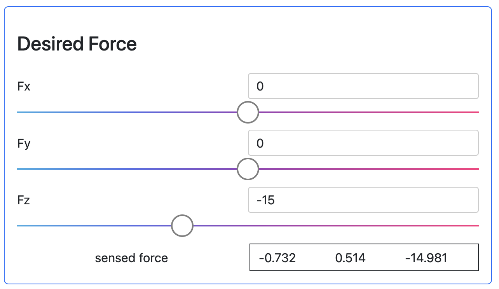
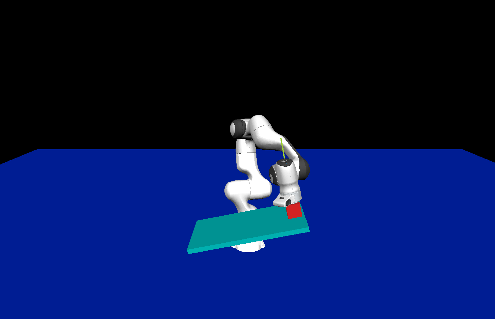

# Tutorial 2 - Controlling a robot arm

This tutorial aims at showcasing some of the control capabilities of OpenSai, how to define controllers and how to interact with them. OpenSai controllers are designed for torque controlled robots, so the output of the controller will always be a vector of joint torques to apply to the robot. We will control a Franka Panda arm in simulation. Let us start with a simulation of the Panda arm. We provide a world file `2_robot_arm_world.urdf` and a xml config file `2_robot_arm.xml` in their respective folders. Note that we don't have a urdf file for the panda in the robot_files folder. This is because we already have a urdf file for the panda in the SaiModel repository, and we can access it from the config and world file. Look at the world file, it should look similar to the one in the first tutorial. We have the panda robot
```
<robot name="Panda">
	<model dir="${OpenSai_MODEL_URDF_FOLDER}/panda" path="panda_arm_box.urdf" name="panda" />
</robot>
```

And two static objects, a floor and a tilted table.

Look at the provided xml config file:
```
<redisConfiguration namespacePrefix="opensai" />

<simvizConfiguration
	worldFilePath="${TUTORIALS_WORLD_FILES_FOLDER}/2_robot_arm_world.urdf">
	<logger logFolderName="log_files/tuto_2/simviz"/>
</simvizConfiguration>
```

Two things to note:
- In the world file, the path to the robot file contains `${OpenSai_MODEL_URDF_FOLDER}/`. This refers to the urdf model folder of the OpenSaiModel repository and this syntax can be used in all urdf and xml files.
- We added a logger tag to the simvizConfiguration to define a custom folder where to log the files instead of using the default one as in the first tutorial.

Start the simulation for tutorial 2
```
sh scripts/tutorial_launch.sh 2
```
and you will see.


You can interact with the simulation similarly to tutorial 1.

## Joint controller

Let us first add a joint controller to the robot. The joint controller will take desired joint positions as inputs and output joint command torques.

To define a controller, we need to add to the xml configuration file a `robotControlConfiguration` tag next to the `simvizConfiguration` tag.

The `robotControlConfiguration` tag has two mandatory attributes defining the robot urdf model file, and the robot name. The robot name is used for the generation of the redis keys for communication, so it is important that it matches the robot name in the simulation or robot driver. In this example, in the world file, you see that the name in the `robot` tag is "Panda". Note that the name we need to use is the attribute of the `robot` tag, and not the one in the `model` tag inside. This can be a little confusing. In this example we need to use "Panda" with a capital 'P', and not "panda". For the urdf file, we will use the same as the one used in the world file.

Here is the `robotControlConfiguration` tag we need to add with its attributes:

```
<robotControlConfiguration robotName="Panda"
	robotModelFile="${OpenSai_MODEL_URDF_FOLDER}/panda/panda_arm_box.urdf">
</robotControlConfiguration>
```

If you try to start the simulation now, it will crash. This is because no controller is actually defined. Let us define our first controller. Add the following inside the `robotControlConfiguration` block:
```
<controller name="joint_controller">
	<jointTask name="joint_task">
	</jointTask>
</controller>
```
Note that we need 2 things for a controller. We need to define a controller tag with a unique name, and inside, we need a list of tasks. The order in the list of tasks defines the task hierarchy in the controller. In this example, the list only has one element, the joint task. This is because a joint tasks uses all the degrees of freedom of the robot, so there is no nullspace left for subsequent tasks.


Start the program, and you will see the robot appear again. Try to drag onto it with the right click, and you will notice it comes back to its initial configuration. Congratulations, you configured your first torque controller !

Let's interact with the controller. Open a web browser and navigate to `localhost:8000`. As before, if you get a message saying it in unreacheable, you may need to start the webui manually
```
python bin/ui/server.py tutorials/tuto_config_folder/xml_files/webui_generated_file/webui.html
```

You will see:


You have different options with this ui:
- Change the goal positions per joint
- Enable/disable dynamic decoupling
- Enable/disable velocity saturation (limitation of velocity via saturation of control force), and modify the velocity limit
- Change the gains
- Enable/disable OTG (online trajectory generation to satisfy velocity, acceleration and jerk limits)
- Start/stop logging data

You can also switch to the simviz tab to interact with the simulation as in tutorial 1. Take some time to explore the ui, and for more information, you can look at the documentation part of the OpenSai repository.

## Cartesian controller

In order to perform control in the cartesian space, we have a second type of tasks besides the joint task. This is the motion force task. The motion force task enables a control of the robot in cartesian space in translation and rotation, as well as a control in force space (forces and moments). It can be parametrized to do operational space control or impedance control. 

Let us add a second controller to our robot. Define a second controller just before the joint controller we set up before, and inside, define two tasks. One motionForceTask first, and a jointTask second. Don't forget to give a different name to this new controller. The motion force task needs two attributes. The `name` attribute defines the task name, and the `linkName` attribute that defines which link of the robot to control. Typically. the link to control will be the robot end effector. The link name must match a link name as defined in the robot urdf file. In our example, you can use "end-effector" for the link name.

<details>
<summary>Solution</summary>
```
<robotControlConfiguration robotName="Panda"
	robotModelFile="${OpenSai_MODEL_URDF_FOLDER}/panda/panda_arm_box.urdf">

	<controller name="cartesian_controller">
		<motionForceTask name="motion_force_task"
			linkName="end-effector">
		</motionForceTask>
		<jointTask name="joint_task">
		</jointTask>
	</controller>

	<controller name="joint_controller">
		<jointTask name="joint_task">
		</jointTask>
	</controller>

</robotControlConfiguration>
```
</details>

Start the simulation again, and open the webui. You should now see something like:


You have two tabs in the motion force task ui. One for motion control and one for force control. Let us focus on the motion control for now. You can change the goal position, goal orientation, gains, dynamic decoupling, vecocity saturation and OTG parameters, as in the joint task. Explore the effects of changing those parameters.

Notice that you also have a purple tab "Joint Task" inside the cartesian controller. This is the joint task in the nullspace of the mation force task. Try clicking on it and modify joint1 position and notice how joint1 moves without disturbing the end effector position or orientation.

Finally, you can also switch to the joint controller that was defined before by clicking on the orange Joint Controller tab. When doing so, you will switch back to the joint controller defined before.

## Interacting with the controller using Python
All the interactions that can be performed via the ui interface are actually performed by changing the values of certain redis keys. Therefore, this can be done from any programming language, such as python for example. Let us try to write a python script that moves the robot left and right. we provide the skeleton for the python script in `tutorials/python_scripts/2_robot_arm_left_right.py`. Let us look at it together step by step:

```
import numpy as np
import time, json, redis
from enum import Enum, auto
```
The imports we need

```
class State(Enum):
  GOING_LEFT = auto()
  GOING_RIGHT = auto()
```
The python script will implement a state machine with two states: going left and going right

```
goal_position_redis_key = "opensai::controllers::Panda::cartesian_controller::motion_force_task::goal_position"
current_position_redis_key = "opensai::controllers::Panda::cartesian_controller::motion_force_task::current_position"
```
The redis keys to read the current position of the robot and send the goal position

```
# redis client
redis_client = redis.Redis()
init_position = np.array(json.loads(redis_client.get(current_position_redis_key)))
state = State.GOING_LEFT
```
Setup the redis client, read the initial position and set the initial state for the state machine.

```
try:
	while True:
		...

except KeyboardInterrupt:
	print("Keyboard interrupt")
	pass
except Exception as e:
	print(e)
	pass
redis_client.set(goal_position_redis_key, json.dumps(init_position.tolist()))

```
We put the infinite loop in a try block to catch errors and exit gracefully and go back to the inital position when exiting the state machine with ctrl+c.

```
	if state == State.GOING_LEFT:
		print("Going Left")
		# ---------------------
		# modify the following line
		goal_position = init_position
		# ---------------------
		redis_client.set(goal_position_redis_key, json.dumps(goal_position.tolist()))
		state = State.GOING_RIGHT
		time.sleep(1.5)

	elif state == State.GOING_RIGHT:
		print("Going Right")
		# ---------------------
		# modify the following line
		goal_position = init_position
		# ---------------------
		redis_client.set(goal_position_redis_key, json.dumps(goal_position.tolist()))
		state = State.GOING_LEFT
		time.sleep(1.5)
```
The core behavior inside the states. Here is it really easy. We print infirmation about the state, define a new goal position, send it to redis for the controller, switch the state and wait.
Modify the indicated lines to make the robot move left and right according to the states

<details>
<summary>Solution</summary>
In the state going left:

```
goal_position = init_position + np.array([0, -0.1, 0])
```

In the state going right:
```
goal_position = init_position + np.array([0, 0.1, 0])
```
</details>

## Using real hardware
If you have access to a real franka panda or franka fr3, you can try controlling the actual robot. If you never used the real robot, this part can be a little difficult and involved so we recommend coming back to it later.

There is one important safety rule when using the real robot and trying new controllers on it:
`Always assume something unexpected can happen`, and be happily surprised if everything goes as planned.
When trying the robot driver, launching the controller, and sending new inputs to the controller for the first time, always pay attention and be ready to stop the robot with the E-Stop at any time.

When using OpenSai with the real hardware, there are 4 main points to keep in mind:
- Do not use a configuration file that enables a simulation for the controlled robots when using real hardware. Otherwise the simulated sensor data will interfere with the real robot sensor data. You have 2 options:
	- Remove the `<simvizConfiguration>` form the config file
	- Set the `<simvizConfiguration>` to vizOnly mode by adding the attribute `mode="vizOnly"` to the `<simvizConfiguration>` tag (only the visualizer will be enabled, no simulation, and the rendered robot will follow the real sensor data).
- The robots often perform gravity compensation on their own. This is why OpenSai controllers don't perform gravity compensation by default, but you can change that by adding the attribute `gravityCompensation="true"` in each `<controller>` tag.
- The urdf models often provide incorrect mass and inertia information, and the robot drivers/API may provide the mass matrix. This is why OpenSai controllers read the mass matrix published by the robot driver or simulation by default. If you want to change that and use the mass matrix computed using the urdf model, you can change that by adding the attribute `getMassMatrixFromRedis="false"` in the `<robotControlConfiguration>` tag.
- Make sure the redis keys are the same between the robot driver and sai controller, otherwise the communication between the two won't work.

We recommend using the [Sai Franka Redis Driver](https://github.com/manips-sai/FrankaPanda) for use with OpenSai.

After installing the driver and once you are able to run it and put the robot in float mode, you can almost control the robot using the config file you made in this tutorial. Follow those steps:
1. Remove the simvizConfiguration from the config file, or set it to vizOnly mode as explained before.
2. Make sure the robot name in the `<controllerConfiguration>` tag is the same as the robot name in the driver config file
3. Launch the driver
4. Launch the controller from the OpenSai repository
```
sh scripts/tutorial_launch.sh 2
```

You can now control the real robot with the webui.

## Force control
Let us go back to the simulation.
If you controlled the real robot at the previous step, stop the robot driver, stop the controller and add back the simulation.

We will now try force control in simulation. first, let us add a simulated force sensor to the simulation:

```
<simvizConfiguration worldFilePath="${TUTORIALS_WORLD_FILES_FOLDER}/2_robot_arm_world.urdf">
	<logger logFolderName="log_files/tuto_2/simviz" />

	<forceSensor robotOrObjectName="Panda"
		linkName="end-effector"
		filterCutoff="5.0" />
</simvizConfiguration>
```

This defined a simulated force sensor at the end effector of the Panda robot, with a low pass second order butterworth filter of cutoff frequency 5 Hz.

In the webui, reset the simulation and make the robot end effector go down. You will see a graphic representation of the force and moment applied on the tilted table as green (force) and red (moment) lines.


Switch to the blue tab called Force Control. From there you can set force gains, chose between open loop or closed loop force control, set force and moment goals, and parametrize the force and moment spaces.

Parametrizing the force and moment spaces means deciding which direction of space is force controlled and which one is motion controlled.

Note that if you set a desired force, nothing changes. Try setting a desired force of -15 N in the Z direction, it does not affect the robot.


Now, set the force space dimension to 1, this will make the controller control force in the z direction, and motion in the x and y direction.


And note that the sensed force is now much closer to the desired force


Now switch to closed loop force control, and note that the z force slowly converges to the desired force


We would like the robot cube end effector to align with the tilted table. To do so we can control zero moments in the x-y plane. Switch the moment space dimension to 2


And notice how the cube aligns with the surface


Try clicking on the Motion tab and change the y goal position of the robot. You will see it slide on the surface, maintaining the contact force and alignment.


There are more examples of controllers and python scripts in the OpenSai repository.

## Next tutorial
[Controlling a robot arm with a haptic device](3_robot_arm_haptic.md)